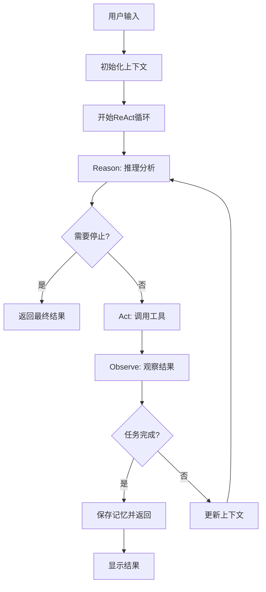

# PPT生成系统优化说明

本次优化对JarvisChain的PPT生成系统进行了全面重构，实现了**完整的ReAct框架**（Reason-Act-Observe循环），具备智能推理、工具调用和结果观察能力。

## 核心亮点

### 🧠 完整ReAct框架（Reason-Act-Observe循环）
系统采用标准的ReAct框架进行决策，包含完整的三步循环：

#### 1. Reason（推理）
- **分析问题**：理解用户需求和当前状态
- **制定计划**：决定下一步最佳行动
- **选择工具**：确定需要调用的工具
- **利用记忆**：检索和应用历史信息

#### 2. Act（行动）
- **调用工具**：执行具体的操作（PPT创建、记忆搜索等）
- **获取信息**：从外部资源获取所需数据
- **执行任务**：完成用户请求的具体步骤

#### 3. Observe（观察）
- **分析结果**：评估行动执行的结果
- **评估进度**：判断任务完成程度
- **决定继续**：确定是否需要继续循环
- **更新上下文**：为下一轮循环准备信息

### 📚 智能记忆检索
- **自动记忆存储**：系统自动保存重要的对话内容和任务结果
- **相关性检索**：基于向量相似度检索相关历史信息
- **上下文增强**：利用记忆信息提供更准确的响应

### 🛠️ 丰富的工具生态系统
系统内置多种工具，在ReAct循环中按需调用：

| 工具名称 | 功能描述 | 使用场景 |
|---------|---------|---------|
| `ppt_create` | 创建PPT演示文稿 | PPT生成任务 |
| `ppt_outline` | 生成PPT大纲 | 结构规划 |
| `memory_search` | 搜索历史记忆 | 信息检索 |
| `memory_save` | 保存信息到记忆 | 信息存储 |
| `ppt_analyze` | 分析PPT结构 | 内容分析 |
| `conversation_state` | 获取对话状态 | 状态查询 |
| `generate_response` | 生成智能回复 | 对话生成 |

### 🔄 智能循环机制
- **最大迭代次数**：防止无限循环（默认5次）
- **动态停止条件**：任务完成时自动停止
- **错误恢复**：出现错误时尝试恢复
- **上下文连续性**：保持整个对话的连续性

## ReAct框架工作流程



## 主要优化内容

### 1. 完整ReAct循环实现

**原有架构（简单Reason-Act）：**
```python
# 旧的实现
reasoning_result = await self._reasoning_phase(user_input)
action_result = await self._acting_phase(user_input, reasoning_result)
return action_result
```

**新架构（完整ReAct循环）：**
```python
# 新的完整ReAct实现
for iteration in range(self.max_react_iterations):
    # Step 1: Reason（推理）
    reasoning_result = await self._reason_step(context)
    if reasoning_result.get("should_stop"):
        break
    
    # Step 2: Act（行动）
    action_result = await self._act_step(reasoning_result, context)
    
    # Step 3: Observe（观察）
    observation_result = await self._observe_step(action_result, context)
    if observation_result.get("task_completed"):
        break
    
    # 更新上下文继续循环
    context.update(observation_result.get("updated_context", {}))
```

### 2. 智能工具调用系统

每个工具都有标准化的接口：
```python
async def _tool_ppt_outline(self, params: Dict[str, Any], context: Dict[str, Any]) -> Dict[str, Any]:
    """PPT大纲生成工具"""
    try:
        outline_prompt = self._build_outline_prompt(context["user_input"], params)
        response = await REASONING_MODEL.ainvoke([...])
        return {
            "success": True, 
            "outline": response.content,
            "tool_used": "ppt_outline"
        }
    except Exception as e:
        return {"success": False, "error": str(e), "tool_used": "ppt_outline"}
```

### 3. ReAct步骤跟踪

每个ReAct步骤都被完整记录：
```python
class ReActStep:
    """ReAct步骤数据结构"""
    def __init__(self, step_type: str, content: str, result: Any = None, timestamp: str = None):
        self.step_type = step_type  # "reason", "act", "observe"
        self.content = content
        self.result = result
        self.timestamp = timestamp or self._get_timestamp()
```

### 4. 智能观察机制

观察阶段具备智能分析能力：
```python
async def _observe_step(self, action_result: Dict[str, Any], context: Dict[str, Any]) -> Dict[str, Any]:
    """观察步骤：分析行动结果，决定是否继续或完成任务"""
    # 构建观察提示词
    observation_prompt = self._build_observation_prompt(action_result, context)
    
    # 执行观察分析
    response = await REASONING_MODEL.ainvoke([...])
    
    # 决定是否继续循环
    return observation_result
```

### 5. PPT大纲生成功能增强 🆕

基于ReAct框架的智能大纲生成：

```python
# 用户请求示例
用户: "生成一个关于AI在医疗领域应用的PPT大纲，15页，面向医院管理层"

# ReAct处理流程
1. REASON: 分析需求 → 识别为PPT大纲任务 → 选择ppt_outline工具
2. ACT: 调用大纲生成工具 → 生成详细markdown大纲
3. OBSERVE: 检查生成质量 → 确认任务完成 → 保存到记忆
```

## 架构改进对比

### 原架构
```
用户 → MasterAgent → PPTAgent → 单次重试 → 结果
```
**问题**：
- 缺乏循环机制
- 无法观察和调整
- 错误处理简单
- 缺少工具生态

### 新架构（完整ReAct）
```
用户输入 → ReAct循环系统
    ├─> Reason（推理）
    │   ├─> 记忆检索
    │   ├─> 意图分析  
    │   ├─> 工具选择
    │   └─> 计划制定
    ├─> Act（行动）
    │   ├─> 工具调用
    │   ├─> 任务执行
    │   └─> 结果获取
    ├─> Observe（观察）
    │   ├─> 结果分析
    │   ├─> 进度评估
    │   └─> 循环决策
    └─> 记忆存储 → 结果输出
```

**优势**：
- ✅ 完整的ReAct循环
- ✅ 智能工具调用
- ✅ 动态结果观察
- ✅ 错误自动恢复
- ✅ 丰富的工具生态

## 使用示例

### 基本ReAct循环演示
```bash
python src/JarvisChain/examples/react_framework_demo.py
```

### 观察ReAct思维过程
```python
# 运行主程序
python src/JarvisChain/main.py

# 输入: "创建一个关于AI的PPT"
# 输出会显示完整的ReAct步骤：
🧠 ReAct思维过程 (6 步):
--------------------------------------------------
🤔 步骤 1 [14:32:15] REASON:
   💭 分析用户需求：需要创建AI主题PPT，选择ppt_create工具...
   
🎬 步骤 2 [14:32:16] ACT:
   💭 执行PPT创建使用工具ppt_create
   🔧 工具: ppt_create ✅
   
👁️ 步骤 3 [14:32:17] OBSERVE:
   💭 观察PPT创建结果，任务未完成，需要继续处理...
```

### ReAct工具使用演示
```python
# 不同类型的请求会调用不同的工具
用户: "生成PPT大纲" → 工具: ppt_outline
用户: "搜索历史" → 工具: memory_search  
用户: "当前状态" → 工具: conversation_state
用户: "创建PPT" → 工具: ppt_create
```

### ReAct错误恢复演示
```python
# 错误场景
用户: "创建一个1000页的PPT"  # 资源限制错误

# ReAct处理过程
1. REASON: 识别PPT创建需求
2. ACT: 尝试创建PPT → 失败（资源限制）
3. OBSERVE: 检测到错误，调整策略
4. REASON: 重新分析，建议合理页数
5. ACT: 生成建议回复
6. OBSERVE: 任务完成
```

## 运行指南

### 1. 基本运行
```bash
python src/JarvisChain/main.py
```

### 2. ReAct框架演示
```bash
python src/JarvisChain/examples/react_framework_demo.py
```

### 3. PPT功能演示
```bash
python src/JarvisChain/examples/ppt_generation_example.py
```

## 技术特性

### ReAct循环控制
- **最大迭代次数**：防止无限循环
- **智能停止条件**：自动检测任务完成
- **上下文传递**：循环间信息保持
- **错误恢复机制**：自动处理和恢复错误

### 工具生态系统
- **标准化接口**：所有工具采用统一接口
- **结果标准化**：统一的成功/失败格式
- **异步支持**：完全异步工具调用
- **错误处理**：完善的错误捕获和报告

### 记忆集成
- **自动存储**：重要信息自动保存
- **智能检索**：基于语义相似度检索
- **上下文增强**：记忆信息增强推理能力
- **跨会话持久**：支持长期记忆保持

## 依赖项

### 核心依赖
- python-pptx
- langchain-openai
- langchain-community
- chromadb
- PyYAML
- Pillow

### 新增依赖（ReAct支持）
- datetime（内置）
- typing（内置）
- asyncio（内置）

## 性能特点

### 智能化提升
- **推理准确性**：每个决策都经过深思熟虑
- **工具选择精度**：根据上下文智能选择工具
- **错误恢复能力**：自动检测和恢复错误
- **对话连续性**：维护长期对话上下文

### 响应时间
- **推理阶段**：通常 1-3 秒
- **行动阶段**：取决于具体工具（1-10 秒）
- **观察阶段**：通常 1-2 秒
- **完整循环**：平均 2-5 轮循环

## 注意事项

1. **首次运行**：需要初始化向量数据库，可能需要一些时间
2. **ReAct循环**：会增加响应时间，但大幅提高准确性
3. **工具调用**：某些工具（如PPT创建）可能需要较长时间
4. **记忆管理**：建议定期清理向量数据库以保持性能
5. **API调用**：ReAct推理会增加OpenAI API调用次数

## 总结

通过实现完整的ReAct框架，系统现在具备了：

### ✅ ReAct核心能力
- **完整的Reason-Act-Observe循环**
- **智能工具调用和结果观察** 
- **动态循环控制和错误恢复**
- **丰富的工具生态系统**

### ✅ 智能化程度
- **更强的推理能力**：每步都经过深思熟虑
- **更好的工具选择**：根据上下文智能选择
- **更高的成功率**：循环优化直到成功
- **更强的适应性**：动态调整策略

### ✅ 用户体验
- **透明的思维过程**：可视化ReAct步骤
- **智能的错误处理**：自动恢复和建议
- **连续的对话体验**：长期记忆和上下文
- **专业的PPT能力**：从大纲到成品的完整流程

这使得JarvisChain不仅仅是一个PPT生成工具，而是一个真正智能的、基于ReAct框架的AI助手系统。 